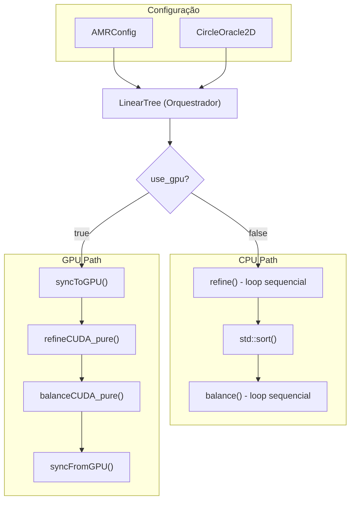
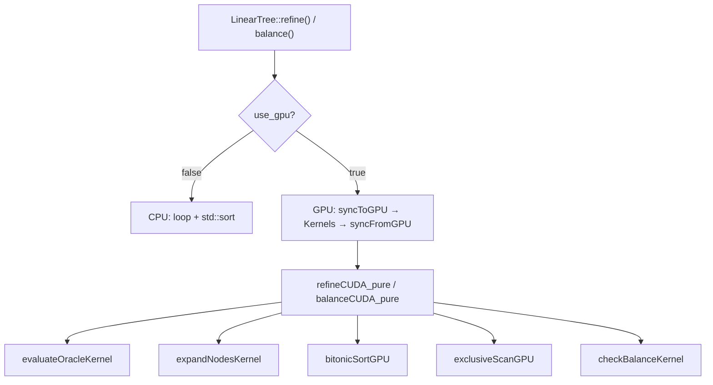

# Análise Comparativa: AMR Sequencial vs CUDA

> **⚠️ Documento histórico (linha `origin/main`).** Descreve a implementação
> CUDA *original*, com bitonic sort e scan escritos à mão em
> `cpp/tree_kernels.cu`. O backend atual (`cuda/tree.cuh`) foi reescrito sobre
> **Thrust** e substitui aqueles kernels — eles permanecem apenas no histórico
> de `origin/main`. Referências a `cpp/...` e `tree_kernels.cu - Linha NNN`
> apontam para o layout antigo, não para a árvore atual `omp/ mpi/ cuda/`.
> Mantido como referência conceitual (Morton, pipeline de refino) e base para
> uma eventual comparação "hand-rolled vs Thrust" no artigo.

Este documento apresenta uma análise técnica aprofundada da implementação de **Adaptive Mesh Refinement (AMR)** comparando a versão sequencial em C++ com a versão paralelizada em CUDA.

---

## Índice

1. [Visão Geral da Arquitetura](#visão-geral-da-arquitetura)
2. [Estruturas de Dados Fundamentais](#estruturas-de-dados-fundamentais)
3. [Morton Encoding (Z-Order Curve)](#morton-encoding-z-order-curve)
4. [Pipeline de Refinamento: Sequencial vs CUDA](#pipeline-de-refinamento-sequencial-vs-cuda)
5. [Pipeline de Balanceamento: Sequencial vs CUDA](#pipeline-de-balanceamento-sequencial-vs-cuda)
6. [Gestão de Memória GPU](#gestão-de-memória-gpu)
7. [Configuração da Grade CUDA](#configuração-da-grade-cuda)
8. [Primitivas Paralelas](#primitivas-paralelas)
9. [Kernels e suas Responsabilidades](#kernels-e-suas-responsabilidades)
10. [Fontes e Referências Open-Source](#fontes-e-referências-open-source)

---

## Visão Geral da Arquitetura

### Arquitetura do Sistema

O `LinearTree` é o **componente central** que orquestra tanto a execução sequencial (CPU) quanto a paralela (GPU), decidindo qual caminho executar baseado no flag `use_gpu`.



### Mapeamento de Arquivos

| Componente | Arquivo |
|------------|---------|
| `LinearTree` | `cuda/tree.cuh` (atual) — era `cpp/tree.hpp` |
| `CircleOracle2D` | `cuda/physics.cuh` (atual) — era `cpp/physics.hpp` |
| CUDA Kernels | `cuda/tree.cuh` (Thrust, atual) — eram `cpp/tree_kernels.cu` (hand-rolled, histórico) |

---

## Estruturas de Dados Fundamentais

### Representação do Nó

A estrutura `Node` é minimalista para maximizar eficiência de memória:

```cpp
// tree.hpp - Linha 21-31
struct Node {
    uint64_t code;   // Código Morton (8 bytes)
    int level;       // Nível na árvore (4 bytes)

    bool operator<(const Node& other) const {
        return code < other.code;  // Ordenação por código Morton
    }
    bool operator==(const Node& other) const {
        return code == other.code && level == other.level;
    }
};
```

> [!NOTE]
> **Decisão de Design**: Usar `uint64_t` para o código Morton permite representar árvores com até 21 níveis em 2D ou 21 níveis em 3D, suportando resoluções extremamente finas.

### Layout de Memória GPU

Na GPU, os dados são armazenados em **Structure of Arrays (SoA)** em vez de Array of Structures (AoS):

```cpp
// tree.hpp - Linha 42-45
#ifdef USE_CUDA
    uint64_t* d_codes = nullptr;   // Array de códigos na GPU
    int* d_levels = nullptr;       // Array de níveis na GPU
    int d_size = 0;                // Tamanho atual
    bool gpu_dirty = false;        // Flag de sincronização
#endif
```

> [!IMPORTANT]
> **Justificativa SoA**: Arrays separados permitem **coalesced memory access** na GPU, onde threads adjacentes acessam posições de memória adjacentes, maximizando a largura de banda.

---

## Morton Encoding (Z-Order Curve)

> [!NOTE]
> **Fonte**: Algoritmo adaptado da biblioteca [libmorton](https://github.com/Forceflow/libmorton) - uma implementação header-only de Morton encoding em C++.

### Conceito

O Morton encoding intercala os bits das coordenadas espaciais, criando uma curva que preserva localidade espacial:

```
Coordenadas 2D:
X = 5 (binário: 101)
Y = 3 (binário: 011)

Spread X: _1_0_1 → 0b010001 (posições ímpares)
Spread Y: _0_1_1 → 0b000101 (posições pares, shift 1)

Morton Code: 0b001011 = 11
```

### Implementação CPU (Sequential)

```cpp
// morton.hpp - Linha 15-23
static uint64_t spread(uint64_t n) {
    // Técnica de "bit dilating" via máscaras progressivas
    n &= MASK_1;                      // 0x00000000FFFFFFFF
    n = (n | (n << 16)) & MASK_2;     // 0x0000FFFF0000FFFF
    n = (n | (n << 8))  & MASK_3;     // 0x00FF00FF00FF00FF
    n = (n | (n << 4))  & MASK_4;     // 0x0F0F0F0F0F0F0F0F
    n = (n | (n << 2))  & MASK_5;     // 0x3333333333333333
    n = (n | (n << 1))  & MASK_6;     // 0x5555555555555555
    return n;
}

static uint64_t encode(uint32_t x, uint32_t y) {
    return (spread(y) << 1) | spread(x);  // Y em bits pares, X em ímpares
}
```

### Implementação GPU

A versão GPU é praticamente idêntica, mas decorada com `__device__ __forceinline__`:

```cpp
// tree_kernels.cu - Linha 13-28
namespace Morton2D_GPU {
    __device__ __forceinline__ uint64_t spread(uint64_t n) {
        const uint64_t MASK_1 = 0x00000000FFFFFFFF;
        const uint64_t MASK_2 = 0x0000FFFF0000FFFF;
        const uint64_t MASK_3 = 0x00FF00FF00FF00FF;
        const uint64_t MASK_4 = 0x0F0F0F0F0F0F0F0F;
        const uint64_t MASK_5 = 0x3333333333333333;
        const uint64_t MASK_6 = 0x5555555555555555;
        
        n &= MASK_1;
        n = (n | (n << 16)) & MASK_2;
        n = (n | (n << 8))  & MASK_3;
        n = (n | (n << 4))  & MASK_4;
        n = (n | (n << 2))  & MASK_5;
        n = (n | (n << 1))  & MASK_6;
        return n;
    }
}
```

> [!TIP]
> **Decisão de Inlining**: `__forceinline__` garante que o compilador NVCC incorpore a função no código do kernel, eliminando overhead de chamada de função.

---

## Pipeline de Refinamento: Sequencial vs CUDA

### Versão Sequencial

O refinamento sequencial itera sobre todos os nós e decide individualmente:

```cpp
// tree.hpp - Linha 133-171
template <typename Oracle>
bool refine(Oracle& oracle) {
    std::vector<Node> new_leaves;
    new_leaves.reserve(leaves.size());  // Pré-alocação
    
    bool has_changed = false;

    // Offsets para filhos (2D: 4 filhos)
    std::vector<std::vector<int>> offsets = {{0,0}, {1,0}, {0,1}, {1,1}};

    for (const auto& node : leaves) {
        if (oracle(node, max_level)) {
            has_changed = true;
            auto current_coords = decode_coords(node.code);
            int new_lvl = node.level + 1;
            uint64_t step = 1ULL << (max_level - new_lvl);

            // Gera 4 filhos
            for (const auto& offset : offsets) {
                std::vector<uint64_t> child_coords = current_coords;
                for(size_t i=0; i<DIM; ++i) 
                    child_coords[i] += offset[i] * step;
                new_leaves.push_back({encode_coords(child_coords), new_lvl});
            }
        } else {
            new_leaves.push_back(node);  // Mantém nó
        }
    }

    if (has_changed) {
        std::sort(new_leaves.begin(), new_leaves.end());  // O(n log n)
        leaves = std::move(new_leaves);
    }
    return has_changed;
}
```

**Complexidade Sequencial**: O(n) para iteração + O(n log n) para ordenação = **O(n log n)**

### Versão CUDA - Pipeline Paralelo

O refinamento CUDA segue um pipeline de 8 estágios:


#### Estágio 1: Avaliação do Oracle

```cpp
// tree_kernels.cu - Linha 222-262
__global__ void evaluateOracleKernel(
    CircleOracleData oracle,
    const uint64_t* codes,
    const int* levels,
    bool* results,
    int n,
    int max_level
) {
    int idx = blockIdx.x * blockDim.x + threadIdx.x;
    if (idx < n) {
        uint64_t code = codes[idx];
        int level = levels[idx];
        
        // Decodifica coordenadas
        uint64_t x, y;
        Morton2D_GPU::decode(code, x, y);
        
        uint64_t size = 1ULL << (max_level - level);
        
        // Centro do nó
        double node_cx = x + size * 0.5;
        double node_cy = y + size * 0.5;
        
        // Distância ao círculo
        double dx = node_cx - oracle.cx;
        double dy = node_cy - oracle.cy;
        double dist_sq = dx*dx + dy*dy;
        
        // Lógica do oracle
        double extent = size * 0.70710678;  // sqrt(2)/2
        double threshold = oracle.bandwidth + extent;
        
        double r = (double)oracle.radius;
        double upper = r + threshold;
        double lower = r - threshold;
        
        // Decisão de refinamento
        results[idx] = (level < oracle.coarse_level) || 
                       (dist_sq < upper*upper && dist_sq > lower*lower && 
                        level < oracle.fine_level);
    }
}
```

> [!NOTE]
> **Paralelismo**: Cada thread processa exatamente um nó. Com n nós e 256 threads por bloco, temos ceil(n/256) blocos.

#### Estágio 3: Contagem de Saídas

```cpp
// tree_kernels.cu - Linha 275-284
__global__ void countOutputsKernel(
    const int* refine_flags,
    int* output_counts,
    int n
) {
    int idx = blockIdx.x * blockDim.x + threadIdx.x;
    if (idx < n) {
        // Se refina: 4 filhos, senão: 1 (mantém)
        output_counts[idx] = refine_flags[idx] ? 4 : 1;
    }
}
```

#### Estágio 7: Expansão de Nós

```cpp
// tree_kernels.cu - Linha 286-330
__global__ void expandNodesKernel(
    const uint64_t* parent_codes,
    const int* parent_levels,
    const int* refine_flags,
    const int* scan_results,       // Prefix sum indica posição de saída
    uint64_t* child_codes,
    int* child_levels,
    int n,
    int max_level
) {
    int idx = blockIdx.x * blockDim.x + threadIdx.x;
    if (idx < n) {
        if (refine_flags[idx]) {
            uint64_t x, y;
            Morton2D_GPU::decode(parent_codes[idx], x, y);
            
            int new_level = parent_levels[idx] + 1;
            uint64_t step = 1ULL << (max_level - new_level);
            
            int out_base = scan_results[idx];  // Índice calculado pelo scan
            
            // Gera 4 filhos em paralelo
            child_codes[out_base + 0] = Morton2D_GPU::encode(x, y);
            child_levels[out_base + 0] = new_level;
            
            child_codes[out_base + 1] = Morton2D_GPU::encode(x + step, y);
            child_levels[out_base + 1] = new_level;
            
            child_codes[out_base + 2] = Morton2D_GPU::encode(x, y + step);
            child_levels[out_base + 2] = new_level;
            
            child_codes[out_base + 3] = Morton2D_GPU::encode(x + step, y + step);
            child_levels[out_base + 3] = new_level;
        } else {
            // Copia nó existente
            int out_idx = scan_results[idx];
            child_codes[out_idx] = parent_codes[idx];
            child_levels[out_idx] = parent_levels[idx];
        }
    }
}
```

> [!IMPORTANT]
> **Decisão Crítica**: O prefix sum (exclusive scan) calcula exatamente onde cada thread deve escrever seus resultados, evitando race conditions sem uso de atomics.

---

## Pipeline de Balanceamento: Sequencial vs CUDA

### Versão Sequencial

O balanceamento 2:1 garante que nós vizinhos não difiram em mais de 1 nível:

```cpp
// tree.hpp - Linha 173-246
void balance() {
    int max_iter = 20;

    // Direções de vizinhança (8 vizinhos em 2D)
    std::vector<std::vector<int>> directions;
    for(int x=-1; x<=1; ++x) 
        for(int y=-1; y<=1; ++y)
            if(x!=0 || y!=0) 
                directions.push_back({x, y});

    for (int iter = 0; iter < max_iter; ++iter) {
        // 1. Constrói mapa para O(1) lookup
        std::unordered_map<uint64_t, Node> node_map;
        node_map.reserve(leaves.size());
        for(const auto& n : leaves) 
            node_map[n.code] = n;

        std::unordered_set<uint64_t> to_refine_codes;

        // 2. Varredura: busca vizinhos que violam 2:1
        for (const auto& node : leaves) {
            int min_valid_level = node.level - 1;
            if (min_valid_level < 1) continue;

            for (const auto& dir : directions) {
                uint64_t base_n_code = get_neighbor_code(node.code, node.level, dir);
                if (base_n_code == UINT64_MAX) continue;

                // Busca em níveis mais grosseiros
                int curr_search_level = node.level - 2;
                while (curr_search_level >= 0) {
                    // Mascara para nível mais grosseiro
                    int shift_bits = (max_level - curr_search_level) * DIM;
                    uint64_t mask = ~((1ULL << shift_bits) - 1ULL);
                    uint64_t coarse_n_code = base_n_code & mask;

                    auto it = node_map.find(coarse_n_code);
                    if (it != node_map.end() && it->second.level == curr_search_level) {
                        to_refine_codes.insert(it->second.code);
                        break;
                    }
                    curr_search_level--;
                }
            }
        }

        // 3. Refina em batch
        if (to_refine_codes.empty()) break;
        
        auto refine_predicate = [&](const Node& n, int) {
            return to_refine_codes.count(n.code) > 0;
        };
        refine(refine_predicate);
    }
}
```

### Versão CUDA - Check Balance Kernel

```cpp
// tree_kernels.cu - Linha 435-476
__global__ void checkBalanceKernel(
    const uint64_t* codes,
    const int* levels,
    int* refine_flags,
    int n,
    int max_level
) {
    int idx = blockIdx.x * blockDim.x + threadIdx.x;
    if (idx < n) {
        int level = levels[idx];
        if (level < 2) return;  // Não pode ter vizinho 2 níveis mais grosseiro
        
        uint64_t code = codes[idx];
        
        // Verifica 8 vizinhos
        for (int dx = -1; dx <= 1; ++dx) {
            for (int dy = -1; dy <= 1; ++dy) {
                if (dx == 0 && dy == 0) continue;
                
                uint64_t n_code = Morton2D_GPU::get_neighbor(
                    code, level, dx, dy, max_level
                );
                
                if (n_code != UINT64_MAX) {
                    // Busca binária para encontrar o nó
                    int n_idx = findNodeIndex(codes, levels, n, n_code, max_level);
                    
                    if (n_idx != -1) {
                        int n_level = levels[n_idx];
                        // Violação: vizinho é 2+ níveis mais grosseiro
                        if (n_level <= level - 2) {
                            // Marca vizinho para refinamento (atômico!)
                            atomicExch(&refine_flags[n_idx], 1);
                        }
                    }
                }
            }
        }
    }
}
```

> [!WARNING]
> **Race Condition**: Múltiplas threads podem tentar marcar o mesmo nó. `atomicExch` garante atomicidade, mas como sempre escrevemos 1, não há problema de ordem.

### Busca Binária na GPU

> [!NOTE]
> **Fonte**: Algoritmo de busca binária adaptado do padrão `std::upper_bound` da STL C++, com modificação para verificar se o código alvo está dentro do range coberto pelo nó encontrado.

```cpp
// tree_kernels.cu - Linha 79-108
__device__ int findNodeIndex(
    const uint64_t* codes, 
    const int* levels, 
    int n, 
    uint64_t target_code, 
    int max_level
) {
    int left = 0;
    int right = n - 1;
    int ans = -1;
    
    // Upper bound - 1: último nó com code <= target
    while (left <= right) {
        int mid = left + (right - left) / 2;
        if (codes[mid] <= target_code) {
            ans = mid;
            left = mid + 1;
        } else {
            right = mid - 1;
        }
    }
    
    if (ans != -1) {
        int level = levels[ans];
        int shift = 2 * (max_level - level);
        // Range coberto pelo nó
        uint64_t range = (shift >= 64) ? UINT64_MAX : (1ULL << shift);
        
        // Verifica se target está dentro do range do nó
        if (target_code < codes[ans] + range) {
            return ans;
        }
    }
    
    return -1;
}
```

---

## Gestão de Memória GPU

### Sincronização Host → Device

```cpp
// tree.hpp - Linha 80-98
void syncToGPU() {
    // Libera memória anterior
    if (d_codes) cudaFree(d_codes);
    if (d_levels) cudaFree(d_levels);
    
    d_size = leaves.size();
    
    // Aloca memória na GPU
    cudaMalloc(&d_codes, d_size * sizeof(uint64_t));
    cudaMalloc(&d_levels, d_size * sizeof(int));
    
    // Prepara dados em memória contígua (SoA transformation)
    std::vector<uint64_t> codes(d_size);
    std::vector<int> levels(d_size);
    for(int i=0; i<d_size; ++i) {
        codes[i] = leaves[i].code;
        levels[i] = leaves[i].level;
    }
    
    // Transferência Host → Device
    cudaMemcpy(d_codes, codes.data(), d_size * sizeof(uint64_t), 
               cudaMemcpyHostToDevice);
    cudaMemcpy(d_levels, levels.data(), d_size * sizeof(int), 
               cudaMemcpyHostToDevice);
    gpu_dirty = false;
}
```

### Sincronização Device → Host

```cpp
// tree.hpp - Linha 100-112
void syncFromGPU() {
    leaves.resize(d_size);
    std::vector<uint64_t> codes(d_size);
    std::vector<int> levels(d_size);
    
    // Transferência Device → Host
    cudaMemcpy(codes.data(), d_codes, d_size * sizeof(uint64_t), 
               cudaMemcpyDeviceToHost);
    cudaMemcpy(levels.data(), d_levels, d_size * sizeof(int), 
               cudaMemcpyDeviceToHost);
    
    // Reconstrói estrutura AoS
    for(int i=0; i<d_size; ++i) {
        leaves[i] = {codes[i], levels[i]};
    }
    gpu_dirty = false;
}
```

### Alocação Dinâmica Durante Refinamento

```cpp
// tree_kernels.cu - Linha 332-433 (refineCUDA_pure)
void refineCUDA_pure(...) {
    // Alocação de arrays temporários
    bool* d_oracle_results;
    int* d_refine_flags;
    int* d_output_counts;
    int* d_scan;
    
    CUDA_CHECK(cudaMalloc(&d_oracle_results, n * sizeof(bool)));
    CUDA_CHECK(cudaMalloc(&d_refine_flags, n * sizeof(int)));
    CUDA_CHECK(cudaMalloc(&d_output_counts, n * sizeof(int)));
    
    // Scan precisa de padding para potência de 2
    int n_padded = 1;
    while (n_padded < n) n_padded *= 2;
    CUDA_CHECK(cudaMalloc(&d_scan, n_padded * sizeof(int)));
    
    // ... execução dos kernels ...
    
    // Nova alocação após saber tamanho exato
    int total_outputs_padded = 1;
    while (total_outputs_padded < total_outputs) total_outputs_padded *= 2;
    
    CUDA_CHECK(cudaMalloc(&d_new_codes, total_outputs_padded * sizeof(uint64_t)));
    CUDA_CHECK(cudaMalloc(&d_new_levels, total_outputs_padded * sizeof(int)));
    
    // ... expansão ...
    
    // Swap de ponteiros e liberação
    cudaFree(d_codes);
    cudaFree(d_levels);
    *d_codes_ptr = d_new_codes;
    *d_levels_ptr = d_new_levels;
    
    // Cleanup dos temporários
    cudaFree(d_oracle_results);
    cudaFree(d_refine_flags);
    cudaFree(d_output_counts);
    cudaFree(d_scan);
}
```

> [!CAUTION]
> **Decisão de Potência de 2**: O Bitonic Sort e o Blelloch Scan requerem arrays com tamanho potência de 2. O padding extra é preenchido com valores sentinela.

---

## Configuração da Grade CUDA

### Escolha do Block Size

```cpp
// cuda_utils.cuh - Linha 31-33
inline int getOptimalBlockSize() {
    return 256;  // Bom padrão para maioria das GPUs modernas
}
```

**Justificativa**:
- **256 threads** = 8 warps de 32 threads
- Múltiplo de 32 para ocupação total dos SMs
- Bom balanço entre ocupação e uso de registradores
- Compatível com GPUs desde Compute Capability 2.0

### Cálculo do Grid Size

```cpp
// tree_kernels.cu - Linha 361-362
int blockSize = 256;
int gridSize = (n + blockSize - 1) / blockSize;  // ceil(n / blockSize)
```

**Exemplo**:
- Se n = 100.000 nós
- gridSize = ceil(100000 / 256) = 391 blocos
- Total threads lançadas = 391 × 256 = 100.096
- Guard clause `if (idx < n)` evita acesso fora dos limites

### Configuração para Bitonic Sort

```cpp
// tree_kernels.cu - Linha 157-158
int blockSize = 256;
int gridSize = (n_padded + blockSize - 1) / blockSize;

for (int k = 2; k <= n_padded; k *= 2) {
    for (int j = k / 2; j > 0; j /= 2) {
        bitonicSortStep<<<gridSize, blockSize>>>(d_codes, d_levels, n_padded, j, k);
    }
}
```

> [!NOTE]
> **Número de Lançamentos**: Para n_padded = 2^k, há Σ(1 + 2 + ... + k) = k(k+1)/2 lançamentos de kernel. Para 1M elementos (k=20), são 210 lançamentos.

---

## Primitivas Paralelas

### Bitonic Sort

> [!NOTE]
> **Fonte**: Implementação adaptada do [NVIDIA CUDA Samples - sortingNetworks](https://github.com/NVIDIA/cuda-samples/tree/master/Samples/2_Concepts_and_Techniques/sortingNetworks) e baseada no capítulo "GPU Gems 2, Chapter 46 - Sorting Networks".

O Bitonic Sort é um algoritmo de ordenação paralela data-oblivious:

```cpp
// tree_kernels.cu - Linha 115-136
__global__ void bitonicSortStep(
    uint64_t* codes, 
    int* levels, 
    int n, 
    int j,    // Distância de comparação
    int k     // Tamanho da subsequência bitônica
) {
    int idx = blockIdx.x * blockDim.x + threadIdx.x;
    int ixj = idx ^ j;  // Parceiro XOR
    
    if (ixj > idx && idx < n && ixj < n) {
        if ((idx & k) == 0) {
            // Região ascendente: garante codes[idx] <= codes[ixj]
            if (codes[idx] > codes[ixj]) {
                // Swap de código e nível juntos
                uint64_t tc = codes[idx]; 
                codes[idx] = codes[ixj]; 
                codes[ixj] = tc;
                
                int tl = levels[idx]; 
                levels[idx] = levels[ixj]; 
                levels[ixj] = tl;
            }
        } else {
            // Região descendente
            if (codes[idx] < codes[ixj]) {
                uint64_t tc = codes[idx]; 
                codes[idx] = codes[ixj]; 
                codes[ixj] = tc;
                
                int tl = levels[idx]; 
                levels[idx] = levels[ixj]; 
                levels[ixj] = tl;
            }
        }
    }
}
```

**Visualização do Bitonic Sort**:

```
Fase k=2:  [a,b] [c,d] → compare-exchange em pares
Fase k=4:  [a,b,c,d] → forma sequência bitônica e merge
Fase k=8:  [a,b,c,d,e,f,g,h] → ...
```

### Blelloch Exclusive Scan (Prefix Sum)

> [!NOTE]
> **Fonte**: Implementação adaptada do [GPU Gems 3, Chapter 39 - Parallel Prefix Sum (Scan) with CUDA](https://developer.nvidia.com/gpugems/gpugems3/part-vi-gpu-computing/chapter-39-parallel-prefix-sum-scan-cuda), baseada no paper original de Blelloch (1990).

Implementação do algoritmo de Blelloch em duas fases:

```cpp
// tree_kernels.cu - Linha 168-183
// Up-Sweep (Reduce)
__global__ void scanUpSweep(int* data, int n, int stride) {
    int idx = (blockIdx.x * blockDim.x + threadIdx.x) * stride * 2;
    if (idx + stride < n) {
        data[idx + stride * 2 - 1] += data[idx + stride - 1];
    }
}

// Down-Sweep (Distribute)
__global__ void scanDownSweep(int* data, int n, int stride) {
    int idx = (blockIdx.x * blockDim.x + threadIdx.x) * stride * 2;
    if (idx + stride < n) {
        int temp = data[idx + stride - 1];
        data[idx + stride - 1] = data[idx + stride * 2 - 1];
        data[idx + stride * 2 - 1] += temp;
    }
}
```

**Orquestrador do Scan**:

```cpp
// tree_kernels.cu - Linha 185-216
void exclusiveScanGPU(int* d_data, int n) {
    int n_padded = 1;
    while (n_padded < n) n_padded *= 2;
    
    // Pad com zeros se necessário
    if (n_padded > n) {
        CUDA_CHECK(cudaMemset(d_data + n, 0, (n_padded - n) * sizeof(int)));
    }
    
    int blockSize = 256;
    
    // Up-sweep: reduz para um único valor
    for (int stride = 1; stride < n_padded; stride *= 2) {
        int gridSize = (n_padded / (stride * 2) + blockSize - 1) / blockSize;
        if (gridSize > 0) {
            scanUpSweep<<<gridSize, blockSize>>>(d_data, n_padded, stride);
        }
    }
    
    // Zera o último elemento (transforma inclusive → exclusive)
    int zero = 0;
    cudaMemcpy(d_data + n_padded - 1, &zero, sizeof(int), cudaMemcpyHostToDevice);
    
    // Down-sweep: distribui as somas parciais
    for (int stride = n_padded / 2; stride >= 1; stride /= 2) {
        int gridSize = (n_padded / (stride * 2) + blockSize - 1) / blockSize;
        if (gridSize > 0) {
            scanDownSweep<<<gridSize, blockSize>>>(d_data, n_padded, stride);
        }
    }
}
```

**Exemplo de Prefix Sum**:

```
Input:        [3, 1, 4, 1, 5, 9, 2, 6]
Output:       [0, 3, 4, 8, 9, 14, 23, 25]
              (exclusive scan - não inclui elemento atual)
```

---

## Kernels e suas Responsabilidades

### Tabela de Kernels

| Kernel | Responsabilidade | Tipo de Paralelismo | Complexidade |
|--------|-----------------|---------------------|--------------|
| `evaluateOracleKernel` | Avalia condição de refinamento | 1 thread/nó | O(1) por thread |
| `markRefinementKernel` | Converte bool → int flags | 1 thread/nó | O(1) por thread |
| `countOutputsKernel` | Calcula saídas (1 ou 4) | 1 thread/nó | O(1) por thread |
| `expandNodesKernel` | Gera filhos ou copia | 1 thread/nó pai | O(1) por thread |
| `checkBalanceKernel` | Detecta violações 2:1 | 1 thread/nó | O(8 log n) por thread |
| `bitonicSortStep` | Uma etapa de ordenação | 1 thread/par | O(1) por thread |
| `scanUpSweep` | Redução do prefix sum | variable | O(1) por thread |
| `scanDownSweep` | Distribuição do prefix sum | variable | O(1) por thread |

### Hierarquia de Chamadas




---

## Fontes e Referências Open-Source

### Morton Encoding

A implementação do Morton encoding utiliza a técnica de **bit dilating** documentada em:

- **Libmorton** (https://github.com/Forceflow/libmorton)
  - Biblioteca C++ header-only para encoding/decoding Morton
  - Referência para as máscaras de spread/compact

- **NVIDIA CUDA Samples** (https://github.com/NVIDIA/cuda-samples)
  - Exemplos de implementações de space-filling curves em CUDA

### Bitonic Sort

- **GPU Gems 2, Chapter 46** - "Sorting Networks"
  - https://developer.nvidia.com/gpugems/gpugems2/part-vi-simulation-and-numerical-algorithms/chapter-46-improved-gpu-sorting

- **CUDA SDK Samples - sortingNetworks**
  - https://github.com/NVIDIA/cuda-samples/tree/master/Samples/2_Concepts_and_Techniques/sortingNetworks

### Blelloch Scan (Prefix Sum)

- **GPU Gems 3, Chapter 39** - "Parallel Prefix Sum (Scan) with CUDA"
  - https://developer.nvidia.com/gpugems/gpugems3/part-vi-gpu-computing/chapter-39-parallel-prefix-sum-scan-cuda
  
- **Paper Original**: Blelloch, Guy E. "Prefix sums and their applications." (1990)
  - Technical Report CMU-CS-90-190, Carnegie Mellon University

### Adaptive Mesh Refinement

- **P4EST** (https://github.com/cburstedde/p4est)
  - Biblioteca paralela para AMR baseada em octrees
  - Referência para algoritmos de balanceamento 2:1

- **AMReX** (https://github.com/AMReX-Codes/amrex)
  - Framework AMR desenvolvido pelo Lawrence Berkeley Lab
  - Referência para estruturas de dados de malha adaptativa

---

## Comparativo de Desempenho

### Operações por Etapa

| Operação | Sequencial | CUDA |
|----------|-----------|------|
| Oracle Evaluation | O(n) serial | O(n/p) paralelo |
| Sorting | O(n log n) - std::sort | O(log²n) - Bitonic |
| Prefix Sum | O(n) | O(log n) |
| Balance Check | O(n × 8 × log n) | O(n/p × 8 × log n) |

Onde:
- n = número de nós
- p = número de threads paralelas na GPU

### Overhead CUDA

1. **Transferência de Memória**: 2 × O(n) por sincronização
2. **Kernel Launch**: ~10-20μs por lançamento
3. **Alocação Dinâmica**: cudaMalloc é significativamente mais lento que malloc

> [!TIP]
> O CUDA é mais eficiente quando n > 10.000 elementos, onde o overhead é compensado pelo paralelismo.

---

## Conclusão

A paralelização CUDA do AMR demonstra decisões arquiteturais fundamentais:

1. **SoA vs AoS**: Separação de códigos e níveis para coalesced access
2. **Primitivas Paralelas**: Bitonic Sort e Blelloch Scan evitam dependências seriais
3. **Atomic Operations**: Usadas minimamente (apenas em `checkBalanceKernel`)
4. **Padding Estratégico**: Garante compatibilidade com algoritmos de potência de 2
5. **Sincronização Lazy**: `gpu_dirty` flag evita transferências desnecessárias

Esta implementação ilustra como algoritmos classicamente sequenciais podem ser refatorados para massiva paralelização, mantendo corretude e eficiência.
